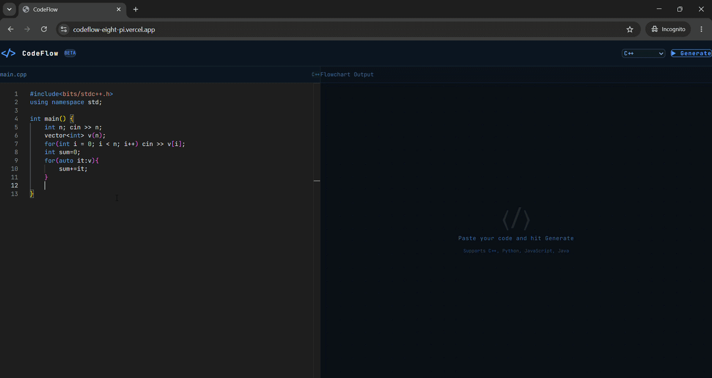

# CodeFlow 🔀

Paste code, get an instant interactive flowchart. Built to make unfamiliar codebases and competitive programming solutions easier to understand at a glance.

🔗 **Live Demo:** https://codeflow-eight-pi.vercel.app/
📦 **Repo:** https://github.com/YashSharma098/codeflow



## What it does

CodeFlow takes any code snippet (C++, Python, JavaScript, Java) and uses Gemini to analyze its control flow — loops, conditions, recursion, function calls — then renders it as a clean, auto-laid-out flowchart using React Flow.

## Features

- 🧠 AI-powered code analysis (Gemini 2.5 Flash)
- 📊 Auto-layout flowchart rendering with React Flow
- 🔁 Detects and visualizes loops as back-edges
- 🌳 Handles recursion, nested conditionals, try/catch
- 🎨 Distinct visual types for start/end, process, decision, and I/O nodes
- ⚡ Multi-language support: C++, Python, JavaScript, Java

## Tech Stack

**Frontend:** React, Vite, Tailwind CSS, React Flow, Monaco Editor
**Backend:** Node.js, Express, Gemini API (`@google/genai`)
**Deployment:** Vercel (frontend), Render (backend)

## How it works

1. User pastes code into a Monaco editor
2. Backend sends the code to Gemini with a structured system prompt
3. Gemini returns flowchart data as JSON (nodes + edges)
4. A custom BFS-based layout engine auto-positions nodes into layers
5. React Flow renders the result with custom node shapes per type
6. Cycle detection identifies loops/recursion and renders them as dashed back-edges

## Running locally

```bash
# Backend
cd backend
npm install
echo "GEMINI_API_KEY=your_key_here" > .env
node index.js

# Frontend (new terminal)
cd frontend
npm install
echo "VITE_API_URL=http://localhost:5000" > .env
npm run dev
```

## Project Structure

```
codeflow/
├── backend/
│   ├── index.js              # Express app entry
│   ├── routes/
│   │   └── flowchart.js      # /api/generate — calls Gemini, validates JSON
│   └── prompts/
│       └── flowchart.js      # System prompt for code → flowchart conversion
└── frontend/
    ├── src/
    │   ├── App.jsx            # Main layout, state, API calls
    │   ├── components/
    │   │   ├── CodeEditor.jsx # Monaco editor wrapper
    │   │   ├── FlowCanvas.jsx # React Flow renderer
    │   │   └── FlowNodes.jsx  # Custom node shape components
    │   └── utils/
    │       └── layout.js      # Cycle detection + BFS layering engine
```